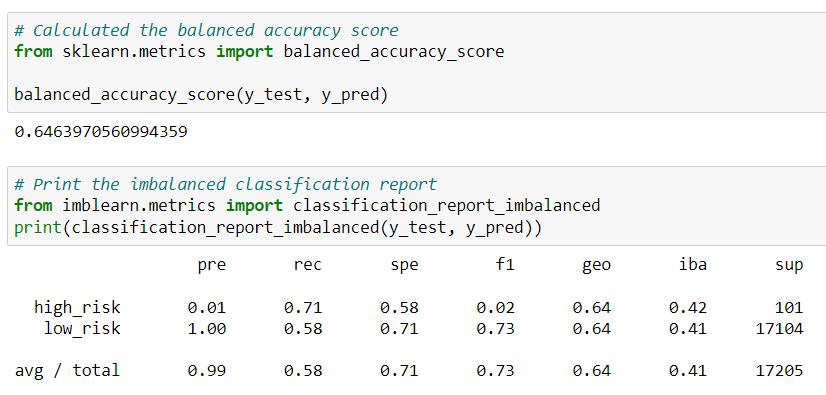
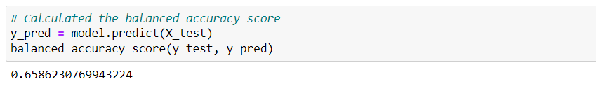
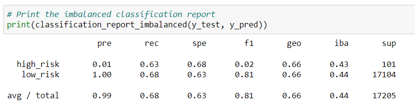
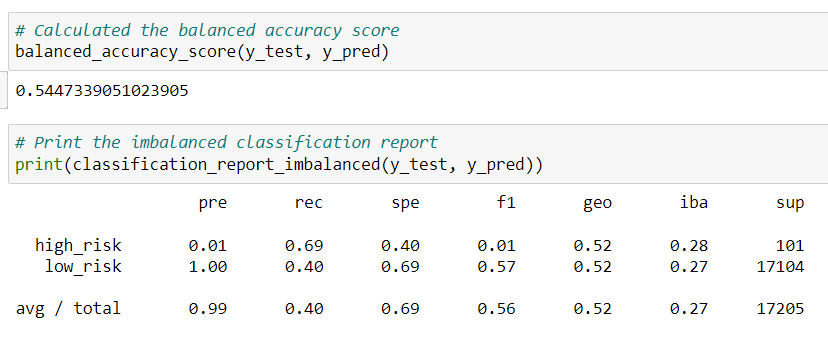
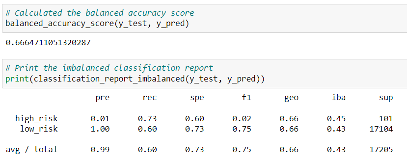
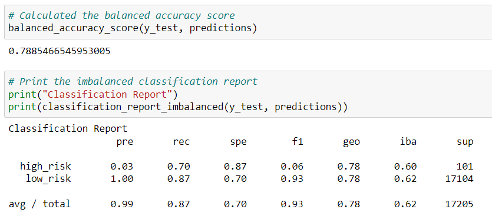
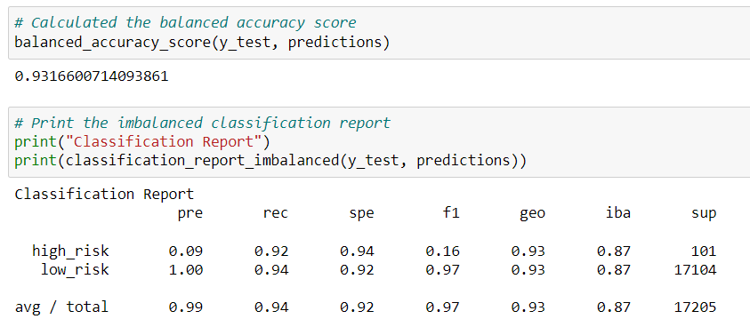

# **Credit Risk Analysis**

## **Overview**

The purpose of this analysis is to predict credit risk for client LendingClub, a peer-to-peer lending services company, by using the imbalanced-learn and scikit-learn libraries to build and evaluate resampling and ensemble classifiers models.

## **Results**

Six machine learning models were built using the LoanStats_2019Q1.csv dataset. The results have been grouped below by resampling or ensemble classifier.

### **Resampling Models Results:**

#### *1) Naive Random Oversampling*
  
  The balanced accuracy score was 0.6463970560994359 with precision scores of 0.01 for high risk and 1.00 for low risk, and recall scores of 0.71 for high risk and       0.58 for low risk.
  
  

#### *2) SMOTE Oversampling*
  
  The balanced accuracy score was 0.6586230769943224 with precision scores of 0.01 for high risk and 1.00 for low risk, and recall scores of 0.63 for high risk and       0.68 for low risk.
  
  
  
  
#### *3) Cluster Centroids Undersampling*
  
  The balanced accuracy score was 0.5447339051023905 with precision scores of 0.01 for high risk and 1.00 for low risk, and recall scores of 0.69 for high risk and       0.40 for low risk.
  
  
  
#### *4) SMOTEENN Combination (Over and Under) Sampling*

  The balanced accuracy score was 0.6664711051320287 with precision scores of 0.01 for high risk and 1.00 for low risk, and recall scores of 0.73 for high risk and       0.60 for low risk.
  
  
  
   
### **Ensemble Classifiers Results:**

#### *5) Balanced Random Forest Classifier*
 
  The balanced accuracy score was 0.7885466545953005 with precision scores of 0.03 for high risk and 1.00 for low risk, and recall scores of 0.70 for high risk and       0.87 for low risk.
  
  

#### *6) Easy Ensemble AdaBoost Classifier*
 
  The balanced accuracy score was 0.9316600714093861 with precision scores of 0.09 for high risk and 1.00 for low risk, and recall scores of 0.92 for high risk and       0.94 for low risk.
  
  

## **Summary** 
Summarize the results of the machine learning models, and include a recommendation on the model to use, if any. If you do not recommend any of the models, justify your reasoning.
